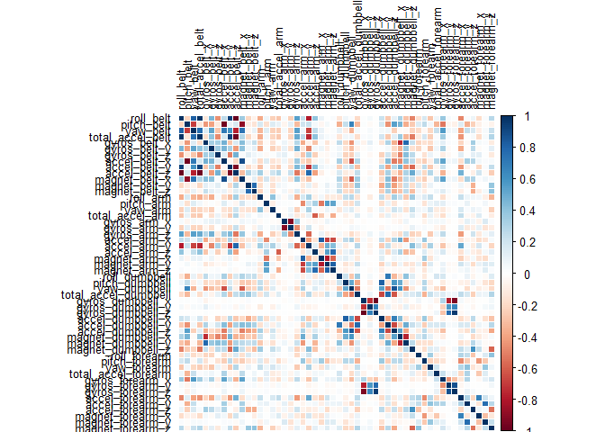
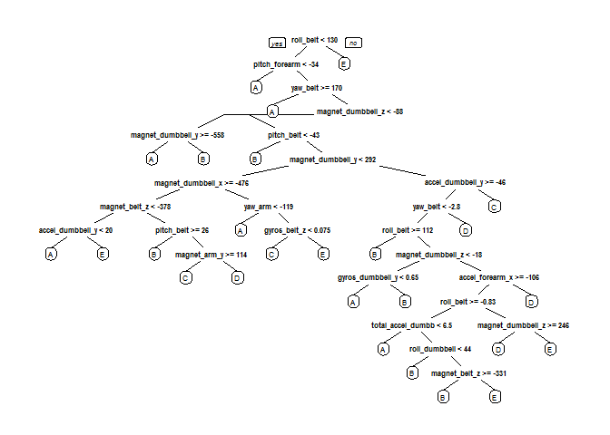

# Practical Machine Learning Prediction Assignment
Yu Hsiou  
## Introduction  
Using devices such as Jawbone Up, Nike FuelBand, and Fitbit it is now possible to collect a large amount of data about personal activity relatively inexpensively. These type of devices are part of the quantified self movement - a group of enthusiasts who take measurements about themselves regularly to improve their health, to find patterns in their behavior, or because they are tech geeks. One thing that people regularly do is quantify how much of a particular activity they do, but they rarely quantify how well they do it.  

In this project, we will use data from accelerometers on the belt, forearm, arm, and dumbell of 6 participants to predict the manner in which they did the exercise.  

### Load Library 

```
## Loading required package: lattice
## Loading required package: ggplot2
## randomForest 4.6-10
## Type rfNews() to see new features/changes/bug fixes.
```
### Download Data

```r
trainUrl <-"https://d396qusza40orc.cloudfront.net/predmachlearn/pml-training.csv"
testUrl <- "https://d396qusza40orc.cloudfront.net/predmachlearn/pml-testing.csv"
trainFile <- "./data/pml-training.csv"
testFile  <- "./data/pml-testing.csv"
if (!file.exists("./data")) {
  dir.create("./data")
}
if (!file.exists(trainFile)) {
  download.file(trainUrl, destfile=trainFile)
}
if (!file.exists(testFile)) {
  download.file(testUrl, destfile=testFile)
}
```
### Read Data
After downloading the data from the data source, we can read the two csv files into two data frames.  

```r
trainRaw <- read.csv("./data/pml-training.csv")
testRaw <- read.csv("./data/pml-testing.csv")
dim(trainRaw)
```

```
## [1] 19622   160
```

```r
dim(testRaw)
```

```
## [1]  20 160
```
The training data set contains 19622 observations and 160 variables, while the testing data set contains 20 observations and 160 variables. The "classe" variable in the training set is the outcome to predict. 

### Clean Data
clean the data & remove identifier columns such as name, timestamps etc

```r
classe <- trainRaw$classe
trainRaw_NA <- apply(trainRaw, 2, function(x) {sum(is.na(x))})
trainRaw <- trainRaw[,which(trainRaw_NA == 0)]
trainRemove <- grepl("^X|timestamp|window", names(trainRaw))
trainRaw <- trainRaw[, !trainRemove]
trainCleaned <- trainRaw[, sapply(trainRaw, is.numeric)]
trainCleaned$classe <- classe

testRaw_NA <- apply(testRaw, 2, function(x) {sum(is.na(x))})
testRaw <- testRaw[,which(testRaw_NA == 0)]
testRemove <- grepl("^X|timestamp|window", names(testRaw))
testRaw <- testRaw[, !testRemove]
testCleaned <- testRaw[, sapply(testRaw, is.numeric)]
```

### split the cleaned testing data into training and cross validation
Then, we can split the cleaned training set into a pure training data set (70%) and a validation data set (30%). We will use the validation data set to conduct cross validation in future steps.  

```r
set.seed(33488) # For reprodcibility
inTrain <- createDataPartition(trainCleaned$classe, p=0.70, list=F)
trainData <- trainCleaned[inTrain, ]
valData <- trainCleaned[-inTrain, ]
```

A random forest model was selected to predict the classification because it has methods for balancing error in class population unbalanced data sets. The correlation between any two trees in the forest increases the forest error rate. Therefore, a correllation plot was produced in order to see how strong the variables relationships are with each other.


```r
corrPlot <- cor(trainData[, -length(names(trainData))])
corrplot(corrPlot, method = "color", tl.cex = 0.8,  tl.col = rgb(0, 0, 0))
```

 
Decision Tree Visualization

```r
treeModel <- rpart(classe ~ ., data=trainData, method="class")
prp(treeModel) # fast plot
```

 

In this type of plot the dark red and blue colours indicate a highly negative and positive relationship respectively between the variables. There isn't much concern for highly correlated predictors which means that all of them can be included in the model.

### Train a prediction model
The out of sample error should be small.  The error will be estimated using the 30% validation sample.


```r
controlRf <- trainControl(method="cv", 5)
modelRf <- train(classe ~ ., data=trainData, method="rf", trControl=controlRf)
modelRf
```

```
## Random Forest 
## 
## 13737 samples
##    52 predictor
##     5 classes: 'A', 'B', 'C', 'D', 'E' 
## 
## No pre-processing
## Resampling: Cross-Validated (5 fold) 
## 
## Summary of sample sizes: 10991, 10990, 10987, 10990, 10990 
## 
## Resampling results across tuning parameters:
## 
##   mtry  Accuracy   Kappa      Accuracy SD   Kappa SD    
##    2    0.9914099  0.9891325  0.0022535125  0.0028518685
##   27    0.9908274  0.9883962  0.0007493825  0.0009486468
##   52    0.9872601  0.9838841  0.0016533261  0.0020923775
## 
## Accuracy was used to select the optimal model using  the largest value.
## The final value used for the model was mtry = 2.
```

### Evaluate the model on the validation dataset


```r
predictRf <- predict(modelRf, valData)
confusionMatrix(valData$classe, predictRf)
```

```
## Confusion Matrix and Statistics
## 
##           Reference
## Prediction    A    B    C    D    E
##          A 1673    1    0    0    0
##          B    4 1131    4    0    0
##          C    0   15 1009    2    0
##          D    0    0   13  950    1
##          E    0    0    0    4 1078
## 
## Overall Statistics
##                                         
##                Accuracy : 0.9925        
##                  95% CI : (0.99, 0.9946)
##     No Information Rate : 0.285         
##     P-Value [Acc > NIR] : < 2.2e-16     
##                                         
##                   Kappa : 0.9905        
##  Mcnemar's Test P-Value : NA            
## 
## Statistics by Class:
## 
##                      Class: A Class: B Class: C Class: D Class: E
## Sensitivity            0.9976   0.9861   0.9834   0.9937   0.9991
## Specificity            0.9998   0.9983   0.9965   0.9972   0.9992
## Pos Pred Value         0.9994   0.9930   0.9834   0.9855   0.9963
## Neg Pred Value         0.9991   0.9966   0.9965   0.9988   0.9998
## Prevalence             0.2850   0.1949   0.1743   0.1624   0.1833
## Detection Rate         0.2843   0.1922   0.1715   0.1614   0.1832
## Detection Prevalence   0.2845   0.1935   0.1743   0.1638   0.1839
## Balanced Accuracy      0.9987   0.9922   0.9900   0.9954   0.9991
```

```r
accuracy <- postResample(predictRf, valData$classe)
accuracy
```

```
##  Accuracy     Kappa 
## 0.9925234 0.9905420
```

```r
oose <- 1 - as.numeric(confusionMatrix(valData$classe, predictRf)$overall[1])
oose
```

```
## [1] 0.007476636
```

The estimated accuracy of the model is 99.2% and the estimated out-of-sample error less than 1%.

### Conclusions
With the abundance of information given from multiple measuring instruments it's possible to accurately predict how well a person is preforming an excercise using a relatively simple model.

### Predict on the test data
Get predictions and evaluate.

```r
predictTest <- predict(modelRf, testCleaned)
predictTest
```

```
##  [1] B A B A A E D B A A B C B A E E A B B B
## Levels: A B C D E
```

### Submission to Coursera
Write submission files to `./answers`.

```r
pml_write_files = function(x){
  n = length(x)
  path <- "./answers"
  for(i in 1:n){
    filename = paste0("problem_id_",i,".txt")
    write.table(x[i],file=file.path(path, filename),quote=FALSE,row.names=FALSE,col.names=FALSE)
  }
}
pml_write_files(predictTest)
```
